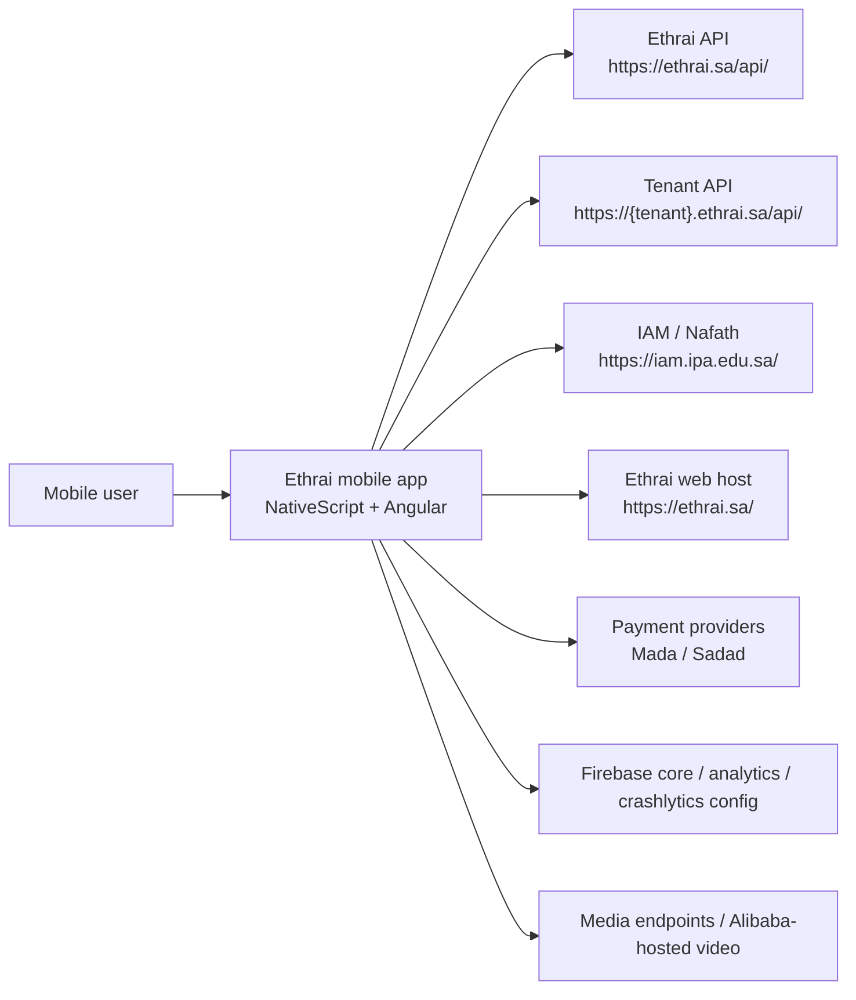
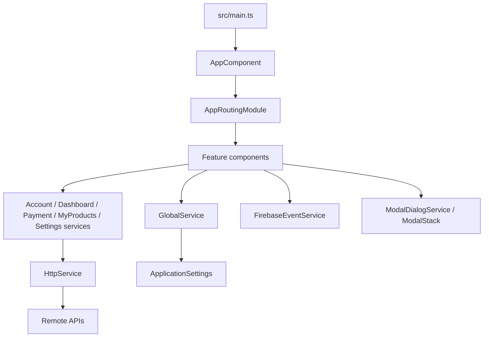
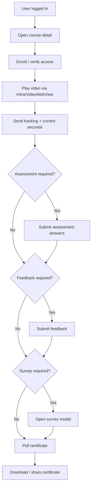

# Project Documentation

This document is based on repository inspection performed on March 9, 2026.

- Confirmed: statements tied directly to checked-in code or config.
- Inferred: conclusions drawn from naming, flows, and backend contracts used by the app.
- Needs confirmation: areas the repository does not prove on its own, especially release operations and backend behavior.

## Table of Contents

1. [Executive Summary](#1-executive-summary)
2. [Project Overview](#2-project-overview)
3. [Tech Stack](#3-tech-stack)
4. [Repository Structure](#4-repository-structure)
5. [Architecture](#5-architecture)
6. [Mobile App Structure](#6-mobile-app-structure)
7. [Core Modules and Components](#7-core-modules-and-components)
8. [Data Layer](#8-data-layer)
9. [Authentication and Security](#9-authentication-and-security)
10. [Platform-Specific Features](#10-platform-specific-features)
11. [Configuration and Environments](#11-configuration-and-environments)
12. [Setup and Installation](#12-setup-and-installation)
13. [Build and Run Guide](#13-build-and-run-guide)
14. [Testing Strategy](#14-testing-strategy)
15. [CI/CD and Release Process](#15-cicd-and-release-process)
16. [Observability and Operations](#16-observability-and-operations)
17. [Performance Considerations](#17-performance-considerations)
18. [Accessibility and UX Quality](#18-accessibility-and-ux-quality)
19. [Troubleshooting](#19-troubleshooting)
20. [Known Risks and Technical Debt](#20-known-risks-and-technical-debt)
21. [Recommended Improvements](#21-recommended-improvements)
22. [Developer Onboarding Guide](#22-developer-onboarding-guide)
23. [Glossary](#23-glossary)
24. [Appendix](#24-appendix)
25. [Quick Start](#quick-start)
26. [Architecture at a Glance](#architecture-at-a-glance)
27. [Top 10 Files to Read First](#top-10-files-to-read-first)
28. [Open Questions / Needs Confirmation](#open-questions--needs-confirmation)

## 1. Executive Summary

### What the project does

Confirmed from code:

- This repository contains a NativeScript + Angular mobile application targeting Android and iOS.
- The app supports user registration, IAM/Nafath login, email/password login, onboarding, browsing training content, purchasing products, managing learning progress, viewing certificates, and submitting support/training partner forms.
- Product types visible in the code include training courses, webinars, knowledge enrichment content, course paths, case studies, training games, interactive exercises, and interactive training activities.

Inferred:

- This is the mobile client for the Ethrai digital learning platform, focused on Arabic-speaking users and also supporting tenant-specific enterprise/LMS contexts.

### Who it is for

- Learners using Ethrai content on mobile.
- Tenant users who belong to more than one organization and must choose an account context.
- Support teams handling tickets and training/contact forms.
- Engineers maintaining mobile client logic, API integrations, payments, and native configuration.

### Main platforms supported

- Android
- iOS

No backend service source code is present in this repository. Backend behavior is observable only through client calls to `https://ethrai.sa/api/` and tenant-specific API domains.

### Key technical highlights

- Cross-platform mobile app built with NativeScript Angular 18.
- Single-module Angular app with a large route table in `src/app/app-routing.module.ts`.
- Runtime tenant switching by changing the API base URL in `src/app/shared/services/http.service.ts`.
- Two login modes:
  - IAM/Nafath-style login via WebView + deep link return.
  - Email/password login with biometric reuse via `@nativescript/fingerprint-auth`.
- Custom inline video playback stack for Alibaba-hosted media using:
  - `src/app/dashboard/course-details/inline-video-webview.android.ts`
  - `src/app/dashboard/course-details/inline-video-webview.ios.ts`
  - `src/app/dashboard/course-details/AlibabaHTMLGenerator.ts`
- External payment flow using Mada redirects and a Sadad modal flow.
- Heavy use of `ApplicationSettings` for session and user preferences.

## 2. Project Overview

### Business purpose

Confirmed from features and routes:

- Deliver training content to mobile users.
- Support discovery, enrollment, payment, playback, feedback, surveys, and certificates.
- Support both first-party Ethrai users and tenant-scoped users.
- Offer support workflows such as contact us, corporate training, and become-a-partner forms.

Inferred:

- The app mixes B2C training marketplace flows with B2B tenant/LMS flows.

### Core features

| Area | Confirmed implementation details |
| --- | --- |
| Authentication | IAM login in `src/app/account/login/login.component.ts`, email login in `src/app/account/login-by-mail/login-by-mail.component.ts`, registration in `src/app/account/register/register.component.ts` |
| Onboarding | Interests, preferred duration, and knowledge level flows in `src/app/onboarding/*` |
| Home and discovery | Highlighted content, banners, search suggestions, categories, highly rated content, last viewed content |
| Product detail | Courses, webinars, KEs, paths, training resources, interactive training details |
| Commerce | Shopping cart, coupon dry-run, checkout, Mada redirect, Sadad popup, payment success/fail routes |
| Learning library | My products, favorites, bookmarks, purchases, certificates, upcoming webinars |
| Support and settings | Notifications inbox, profile editing, change password, support tickets, about/help/contact/partner/training pages |
| Content authoring | Interactive training list/form/view/report flows |

### Supported user flows

1. Open app -> splash/login.
2. Sign in via IAM or email/password.
3. If multiple tenants exist, choose tenant in `src/app/account/choose-account/choose-account.component.ts`.
4. Complete onboarding if preferences are missing:
   - `categories`
   - `duration`
   - `knowledge`
5. Land on `highlighted`.
6. Discover content through home banners, search, categories, or favorites.
7. Open detail page for a course/webinar/path/KE/training resource.
8. Enroll directly for free content or add paid content to cart and check out.
9. Consume content, submit ratings/feedback/survey, and obtain certificate where applicable.
10. Manage purchases, certificates, bookmarks, tickets, and profile settings.

### Platform scope

| Scope | Status |
| --- | --- |
| Android app | Confirmed |
| iOS app | Confirmed |
| Shared cross-platform UI/business logic | Confirmed |
| Native Android customizations | Confirmed |
| Native iOS customizations | Confirmed |
| Backend-for-mobile code in repo | Not present |
| Shared KMP/Flutter/React Native modules | Not present |

## 3. Tech Stack

### Languages

- TypeScript for app logic
- Angular HTML templates
- CSS for global and component styling
- XML for Android resources
- JavaScript for Android splash bootstrap in `app/SplashScreen.js`
- Ruby for iOS CocoaPods hooks in `App_Resources/iOS/Podfile`
- Groovy for Android Gradle config in `App_Resources/Android/app.gradle`

### Frameworks and runtime

| Category | Details | Evidence |
| --- | --- | --- |
| Mobile framework | NativeScript | `package.json`, `nativescript.config.ts` |
| UI framework | Angular 18 | `@angular/*` in `package.json` |
| NativeScript Angular bridge | `@nativescript/angular` 18 | `package.json` |
| Core runtime | `@nativescript/core` 9.x | `package.json` |
| Router | Angular Router via NativeScript | `src/app/app-routing.module.ts` |

### SDKs and mobile libraries

| Library | Usage in repo |
| --- | --- |
| `@nativescript/fingerprint-auth` | Biometric login in `src/app/account/login-by-mail/login-by-mail.component.ts` |
| `@nativescript/firebase-core` | Firebase init in `src/app/app.component.ts` |
| `@nativescript/firebase-analytics` | Analytics wrapper in `src/app/shared/services/firebase.event.service.ts` |
| `@nativescript/imagepicker` | Profile image and interactive training media selection |
| `@nativescript/datetimepicker` | Birthdate selection in registration |
| `nativescript-appurl` | Deep link handling |
| `nativescript-inappbrowser` | External browser/payment/IAM launches |
| `nativescript-windowed-modal` | Modal stack support in `src/main.ts` |
| `nativescript-ui-listview` | Long list UIs |
| `nativescript-drop-down` | Multiple selector/dropdown UIs |
| `@nativescript/social-share` | Sharing certificates and content |
| `nativescript-store-ratings` | App rating from account page |
| `nativescript-qr-generator` | Interactive training QR code generation |
| `@nativescript/payments` | Imported in checkout, but active flow still uses external checkout redirect |

### Build tools

- NativeScript CLI
- Webpack via `@nativescript/webpack`
- Android Gradle
- Xcode + CocoaPods for iOS

### Package manager

- npm with `package-lock.json`

### Key third-party and external services

| Service | Purpose |
| --- | --- |
| `https://ethrai.sa/api/` | Primary backend API |
| `https://{tenant}.ethrai.sa/api/` | Tenant-specific backend API |
| `https://ethrai.sa/` | Web host used for reCAPTCHA page and shared links |
| `https://api.country.is/` | Country code lookup during email login |
| `https://iam.ipa.edu.sa/` | IAM/Nafath authentication entrypoint |
| Firebase | Analytics/core/crashlytics config present |
| Mada/Sadad | Payment completion flow |
| Alibaba/Aliyun VOD | Video/media playback sources inferred from player code |

### Build/system details

- `src` is the app root.
- `App_Resources` contains native resources.
- Android build targets SDK 35 and min SDK 23 in Gradle.
- iOS Podfile forces deployment target 12.0.

## 4. Repository Structure

### Top-level structure

| Path | Purpose |
| --- | --- |
| `src/` | Main NativeScript Angular application |
| `App_Resources/` | Native Android and iOS resources/configuration |
| `environments/` | Environment configuration; only one environment file is present |
| `app/` | Legacy app-level assets including Android splash bootstrap JS |
| `hooks/` | NativeScript hooks for localize/firebase checks |
| `schema/` | NativeScript schema file |
| `platforms/` | Generated NativeScript platforms directory; ignored by git |
| `node_modules/` | Installed dependencies; ignored by git |
| `ethrai-release-key.jks` | Android signing keystore present in repo root |
| `English_translate.json` | Translation artifact not referenced by inspected runtime code |

### Source code handoff note

Team-provided operational note:

- Source code delivery includes both Android and iOS application source within this repository.

### Application directory structure

| Path | Purpose |
| --- | --- |
| `src/main.ts` | Application bootstrap |
| `src/app/app.module.ts` | Root Angular module; declares the whole app |
| `src/app/app-routing.module.ts` | Full route map |
| `src/app/account/` | Authentication, onboarding entry, profile/account flows |
| `src/app/onboarding/` | Interests/duration/knowledge onboarding |
| `src/app/dashboard/` | Home, discovery, product detail, training resources, interactive training |
| `src/app/payment/` | Cart, checkout, Sadad modal, payment result screens |
| `src/app/my-products/` | Library, favorites, bookmarks, certificates, purchases |
| `src/app/settings/` | Notifications, about/help/contact/partner/training/settings |
| `src/app/shared/models/` | DTOs and view models |
| `src/app/shared/services/` | App-wide services such as HTTP, auth guard, state, analytics |
| `src/app/shared/utils/` | Utility code such as image compression and toasts |
| `src/app/shared/pipes/` | Localize pipe |
| `src/i18n/ar.default.json` | Main app localization bundle |
| `src/app.css` | Global styling |
| `src/app.ios.css` | iOS-specific/global styling overrides |

### Native resource structure

| Path | Purpose |
| --- | --- |
| `App_Resources/Android/src/main/AndroidManifest.xml` | Android app metadata, permissions, deep links |
| `App_Resources/Android/app.gradle` | Android SDK versions and dependencies |
| `App_Resources/Android/src/main/res/xml/network_security_config.xml` | Network trust and cleartext policy |
| `App_Resources/iOS/Info.plist` | iOS app metadata, entitlements, permissions |
| `App_Resources/iOS/app.entitlements` | Associated domains / Universal Links |
| `App_Resources/iOS/Podfile` | iOS pod post-install adjustments |
| `App_Resources/iOS/build.xcconfig` | iOS development team configuration |
| `App_Resources/Android/app/google-services.json` | Firebase Android config |
| `App_Resources/iOS/GoogleService-Info.plist` | Firebase iOS config |

### Observed generated or legacy areas

- `src/app/item/` appears to be leftover NativeScript template content and is not part of the main route tree.
- `src/app/my-products/downloaded/` is currently a placeholder screen.
- `src/app/account/new-password/`, `src/app/settings/content-language/`, `src/app/settings/download-settings/`, and `src/app/settings/learning-reminder/` are minimal and appear incomplete.

## 5. Architecture

### Overall system design

This is a single mobile client application with:

- One Angular root module.
- One global route table.
- Feature services that call a shared `HttpService`.
- Cross-cutting in-memory/session state managed through `GlobalService`.
- Native resource folders for Android and iOS.

There is no modular backend or server code in the repository. The app depends on remote HTTP APIs.

### System context



### Internal architecture



### Mobile app architecture pattern used

Confirmed:

- The app follows a service-driven Angular component architecture rather than MVVM with a formal state framework.
- Most business logic lives inside components and singleton services.
- There is no NgRx, Akita, Redux, signal store, or dedicated repository layer.

Characteristics:

- UI state is often kept inside page components.
- Shared state is stored in `GlobalService`.
- Persistent session/preferences state is stored in `ApplicationSettings`.
- Network calls are typically triggered directly from components through a feature service.

### Module boundaries

| Module | Responsibility |
| --- | --- |
| `account` | Auth, registration, tenant selection, profile/account actions |
| `onboarding` | First-run preference capture |
| `dashboard` | Home/discovery/detail/interactive training |
| `payment` | Cart and checkout |
| `my-products` | Library, certificates, purchases, favorites |
| `settings` | Notifications, support, informational pages, settings |
| `shared` | DTOs, services, pipes, utilities |

### Data flow

Typical request flow:

1. A route activates a component.
2. The component reads session/global context from `GlobalService`.
3. The component calls a feature service.
4. The feature service delegates to `HttpService`.
5. `HttpService` attaches the bearer token if needed and calls the remote API.
6. The component updates local state and may persist selected fields back to `GlobalService` or `ApplicationSettings`.

### Backend interaction model

Backend communication is thin-client and endpoint-oriented:

- No GraphQL.
- No generated API client.
- No interceptor chain for retries, auth refresh, request correlation, or error normalization.
- Some endpoints are public and some are bearer-protected.

### State management approach

Confirmed:

- `src/app/shared/services/global.service.ts` acts as the central app state holder.
- `ApplicationSettings` is used to persist:
  - token
  - refresh token
  - token timestamps
  - keep-logged-in flag
  - tenant domain and tenant flags
  - video quality and autoplay
  - saved login credentials
  - deleted accounts list
  - some per-course feedback/survey markers
- Many screens also pass state via route params or `Router.navigate(..., { state })`.

### Dependency injection approach

- Standard Angular DI.
- Services are mostly `providedIn: 'root'`.
- `AppModule` also lists core services in `providers`.
- There is no dedicated DI module or abstraction layer for environment-specific bindings.

### Separation of concerns

Strengths:

- Network access is grouped by feature service.
- Shared persistence is centralized in `GlobalService`.
- Native playback customization is isolated into dedicated files.

Weaknesses:

- `src/app/dashboard/course-details/course-details.component.ts` is 2,070 lines and combines UI, playback, progress tracking, assessments, feedback, survey, and certificate orchestration.
- `src/app/shared/services/firebase.event.service.ts` is 1,921 lines of analytics event wrappers.
- The root module and route table are monolithic.
- Several screens contain business rules that would be better moved to dedicated facades or domain services.

## 6. Mobile App Structure

### Entry points

| Platform area | Entry point / file | Notes |
| --- | --- | --- |
| Shared bootstrap | `src/main.ts` | Bootstraps Angular app and registers `ModalStack` |
| Root component | `src/app/app.component.ts` | Initializes deep linking, Firebase, Android back behavior |
| Android splash | `app/SplashScreen.js` | Custom splash activity using `AwesomeSplash` |
| Android manifest | `App_Resources/Android/src/main/AndroidManifest.xml` | Declares launcher, permissions, and app links |
| iOS app metadata | `App_Resources/iOS/Info.plist` | Declares bundle version, capabilities, permissions |

### App lifecycle handling

Confirmed:

- `AppComponent.ngOnInit()` initializes:
  - deep links via `handleOpenURL`
  - Firebase core
  - Android hardware back overrides for payment routes
- Android back handling is customized for:
  - `/payment-failed`
  - `/shopping-cart` after a failed payment
  - `/payment-success`
  - `/course-details` after payment success

### Screen/page structure

#### Authentication and account

- `login`
- `login-by-mail`
- `register`
- `forgot-password`
- `new-password`
- `choose-account`
- `profile-view`
- `profile-form/:email`
- `change-password`

#### Onboarding

- `categories`
- `duration`
- `knowledge`
- `register-confirm`
- `regiser-confirm/:email`

#### Home and discovery

- `highlighted`
- `explore`
- `search-result`
- `filter/:type`
- `category/:id/:categoryNameAr`
- `training-course/:id/:categoryNameAr`
- `online-classes`
- `traing-path/:id/:categoryNameAr`
- `kes/:id/:categoryNameAr`

#### Detail pages

- `course-details/:courseId`
- `course-details/:courseId/:detailId`
- `webinar-details/:webinarId`
- `course-path-details/:pathId`
- `ke-details/:keId`
- `training-resources-detail/:detailsId/:type?`

#### Commerce and library

- `shopping-cart`
- `checkout/:coupon`
- `payment-success`
- `payment-failed`
- `my-products`
- `favorites`
- `downloaded`
- `bookmarks`
- `certificates`
- `purchases`
- `upcoming`

#### Settings and support

- `notifications`
- `video-settings`
- `download-settings`
- `content-language`
- `learning-reminder`
- `about-ethrai`
- `contactus`
- `helpcenter`
- `become-partner`
- `corporate-training`
- `instructor/:instructorId`
- `WebinarInstructor/:WebinarInstructorId`

#### Interactive content

- `cases-study`
- `training-game`
- `interactive-exercises`
- `interactive-training-list`
- `interactive-training-form(/:id)`
- `interactive-training-view(/:detailsId)`
- `interactive-training-report(/:detailsId)`
- `DigitalLibrary(/:type)`
- `Reporting/:detailsId/:type`

### Navigation model

Confirmed:

- Primary navigation is route-based through `NativeScriptRouterModule`.
- The root route `''` is guarded by `AuthGuard` and resolves to `HighlightedComponent`.
- Tappable icon navigation is implemented in `src/app/dashboard/tab-navigation/tab-navigation.component.html`.
- Many screens navigate with `RouterExtensions.navigate` and `clearHistory: true` after auth transitions.

Notable behavior:

- No lazy-loaded feature modules.
- No nested navigation graphs beyond the root `page-router-outlet`.
- A large amount of state restoration depends on `GlobalService`.

### UI architecture

- Component-per-screen structure with NativeScript XML/Angular HTML templates.
- Shared cards and modal components are used for repeated product and confirmation UI.
- A large amount of styling is global rather than locally scoped.

### Shared components

Examples:

- `src/app/dashboard/highlighted-card/highlighted-card.component.ts`
- `src/app/dashboard/training-program-card/training-program-card.component.ts`
- `src/app/dashboard/training-path-card/training-path-card.component.ts`
- `src/app/dashboard/ke-webinar-card/ke-webinar-card.component.ts`
- `src/app/dashboard/course-rating-modal/course-rating-modal.component.ts`
- `src/app/dashboard/product-feedback/product-feedback.component.ts`
- `src/app/payment/sadad-popup/sadad-popup.component.ts`
- `src/app/settings/modal/modal.component.ts`

### Theme and styling system

Confirmed:

- Global styling lives mainly in `src/app.css` and `src/app.ios.css`.
- The app imports `@nativescript/theme`.
- Arabic fonts and Font Awesome assets are bundled under `src/fonts/`.
- Many screens use shared colors such as `#1056A5`, `#31C0CC`, `#f5f6f7`, and dark blue gradients.

### Localization / internationalization

Confirmed:

- Main localization bundle: `src/i18n/ar.default.json`.
- Localized strings are accessed using `@nativescript/localize` and the custom `L` pipe in `src/app/shared/pipes/localize.pipe.ts`.
- iOS also contains `App_Resources/iOS/ar.lproj/Localizable.strings`.

Needs confirmation:

- Runtime English support does not appear complete.
- `src/app/settings/content-language/content-language.component.ts` exposes a language UI but does not persist or switch locale.
- `English_translate.json` exists in the repo root but was not found in the runtime path.

### Asset handling

- Images are bundled under `src/images/`.
- App fonts are bundled under `src/fonts/`.
- Profile and interactive training image uploads are compressed in `src/app/shared/utils/image-compression.util.ts` before API upload.

## 7. Core Modules and Components

### Module summary

| Module | Purpose | Main files | Key notes |
| --- | --- | --- | --- |
| Account | Auth, registration, tenant selection, profile/account | `src/app/account/*`, `src/app/account/account.service.ts` | Supports IAM and email login; biometric reuse; profile image upload |
| Onboarding | Capture training interests/preferences | `src/app/onboarding/*` | Writes tags to profile and preferences to backend |
| Dashboard | Home, discovery, detail, learning playback | `src/app/dashboard/*`, `src/app/dashboard/dashboard.service.ts` | Biggest feature area; contains custom video playback |
| Payment | Cart and checkout | `src/app/payment/*`, `src/app/payment/payment.service.ts` | Uses remote order APIs plus web-based payment redirect |
| My Products | User-owned/enrolled content | `src/app/my-products/*`, `src/app/my-products/my-products.service.ts` | Combines courses, paths, webinars, KEs, certificates, purchases |
| Settings | Notification preferences, support, info pages | `src/app/settings/*`, `src/app/settings/settings.service.ts` | Uses backend HTML fragments and ticket APIs |
| Shared | State, HTTP, auth guard, models, utils | `src/app/shared/*` | Cross-cutting plumbing |

### Important components

#### `LoginComponent`

File: `src/app/account/login/login.component.ts`

Purpose:

- IAM/Nafath-style login.
- Opens an embedded WebView pointing to the tenant IAM URL.
- Detects return to `iamchecking`, extracts the encrypted payload, and exchanges it with `Account/HandleIamChecking`.

Design notes:

- Relies on backend-provided tenant metadata such as `currentUrl` and `provideID`.
- Uses both WebView URL interception and app-level deep link handling.

#### `LoginByMailComponent`

File: `src/app/account/login-by-mail/login-by-mail.component.ts`

Purpose:

- Email/password login.
- Optional biometric login after a previous successful credential login.

Important behaviors:

- Saves credentials into `ApplicationSettings` through `GlobalService.setLoginCredintials(...)`.
- Uses `didFingerprintDatabaseChange()` to invalidate saved credentials if biometric enrollment changes.

#### `RegisterComponent`

File: `src/app/account/register/register.component.ts`

Purpose:

- Handles multi-branch registration for Saudi, resident, and non-Saudi users.

Important design decisions:

- Saudi flow supports Hijri birthdate fields.
- Non-Saudi flow uses Gregorian date picker.
- Uses a hosted reCAPTCHA page at `environment.WEB_API + 'reCAPTCHA.htm'`.

#### `ChooseAccountComponent`

File: `src/app/account/choose-account/choose-account.component.ts`

Purpose:

- Switches between Ethrai and tenant API domains.

Extension point:

- Any future tenant-specific branding, feature flags, or entitlement loading should likely begin here.

#### `HighlightedComponent`

File: `src/app/dashboard/highlighted/highlighted.component.ts`

Purpose:

- Home screen.
- Loads banner images, suggested webinars, highly rated content, last viewed content, categories, and digital library shortcuts.

Important behavior:

- Starts a timer to rotate banners every 4 seconds.
- Reads unread notification count and cart count for logged-in first-party users.

#### `ExploreComponent`

File: `src/app/dashboard/explore/explore.component.ts`

Purpose:

- Search-first discovery page.
- Calls preview search endpoints and navigates into full results.

#### `SearchResultComponent`

File: `src/app/dashboard/search-result/search-result.component.ts`

Purpose:

- Fetches up to 200 results from the backend and filters them locally in memory.

Important design decision:

- Filters are not re-queried from the server after the initial fetch.

#### `CourseDetailsComponent`

File: `src/app/dashboard/course-details/course-details.component.ts`

Purpose:

- Course detail, playback, assessments, survey, feedback, certificate, and progress tracking.

Important details:

- Registers the custom `InlineVideoWebView`.
- Uses `AlibabaHTMLGenerator` to build HTML5 playback pages.
- Tracks percent watched and current time.
- Posts progress via `setCourseTracking()` and `setVideoSeconds()`.
- Submits assessments with `submitAssessmentAnswers()`.
- Polls certificate readiness using `retryWhen(delay(2000))`.
- Persists local completion markers using keys such as `feedback_<courseId>` and `survey_<courseId>`.
- Includes extensive cleanup to avoid duplicate WebView events and stale native resources.

#### `TrainingResourcesDetailComponent`

File: `src/app/dashboard/training-resources-detail/training-resources-detail.component.ts`

Purpose:

- Displays case studies, training games, and interactive exercises.

Important behaviors:

- Applies `FLAG_SECURE` on Android and a black overlay on iOS to reduce screen capture risk for protected content.
- Handles enroll/cart/payment rules similarly to course detail flows.

#### `CheckoutComponent`

File: `src/app/payment/checkout/checkout.component.ts`

Purpose:

- Finalizes user orders.

Important behaviors:

- Uses `UserData/orders` for order creation.
- If payment method is Mada, opens redirect URL in `InAppBrowser`.
- If payment method is Sadad, opens `SadadPopupComponent`.
- Contains imports from `@nativescript/payments`, but the active path is still remote web checkout rather than native store billing.

#### `CertificatesComponent`

File: `src/app/my-products/certificates/certificates.component.ts`

Purpose:

- Searches, downloads, and shares certificates.

Important business rule:

- Hides certificates for some foreign/GCC users until name approval status is `Approved`.

#### `NotificationsComponent`

File: `src/app/settings/notifications/notifications.component.ts`

Purpose:

- Shows in-app notifications and toggles profile notification/email settings.

Important clarification:

- This is an inbox backed by `Notification/get`, not FCM/APNs push registration.

### Extension points

- Add a new product type by extending:
  - route table
  - dashboard/my-products services
  - detail page navigation
  - analytics wrapper
- Add new native integrations under `App_Resources` plus platform-specific `.android.ts` / `.ios.ts` wrappers.
- Move large component logic into facades first before adding major new learning workflows.

## 8. Data Layer

### HTTP foundation

File: `src/app/shared/services/http.service.ts`

Confirmed behavior:

- `getRequest()` and `postRequest()` use `this.apiURL`.
- `getAuthRequest()` and `postAuthRequest()` attach `Authorization: Bearer <token>`.
- No interceptors, no request retries, no refresh middleware, no standard error envelope mapping.

### Service-to-endpoint mapping

| Service | Representative endpoints |
| --- | --- |
| `AccountService` | `Account/login/mobile`, `Account/register`, `Account/forgotpassword`, `Profile/full`, `Profile/preferences`, `Account/changepassword`, `Account/HandleIamChecking`, `Lookups/nationalities`, `Lookups/tags`, `Lookups/genders` |
| `DashboardService` | `Commons/products/search`, `Courses/:id`, `Webinars/:id`, `KnowledgeEnrichment/:id`, `Courses/coursePath/full/:id`, `UserData/course/enroll/:id`, `UserData/courses/enroll/tracking`, `UserData/courses/assessments/bulk`, `Media/subtitle/:id`, `UserData/courses/enrollments/:id/certificate`, `TrainingResources/*`, `Lookups/survey/*` |
| `PaymentService` | `UserData/shopcarts`, `UserData/orders/dryrun`, `UserData/orders`, `UserData/orders/apple`, `UserData/maintenance/state` |
| `MyProductsService` | `UserData/courses/enrolled`, `UserData/coursepath/enrolled`, `UserData/webinars/detailedEnrolled`, `UserData/products/favorites`, `UserData/certs`, `UserData/orders`, `UserData/kes/watched` |
| `SettingsService` | `Notification/get`, `Notification/{type}/markallasread`, `Tenants/contactInfos`, `UserData/usertickets`, `Lookups/footerlinks`, `Lookups/pageParts/AboutUs`, `Tenants/getInTouch/submit` |

### API integration reference

Team-provided API documentation note:

- All endpoints are listed inside the service files below:
  - `src/app/settings/settings.service.ts`
  - `src/app/account/account.service.ts`
  - `src/app/dashboard/dashboard.service.ts`
  - `src/app/my-products/my-products.service.ts`
  - `src/app/payment/payment.service.ts`
- Base environment API URL:

```ts
API_URL: 'https://ethrai.sa/api/'
```

### Request/response handling

Strengths:

- Several typed DTOs exist under `src/app/shared/models/`.
- `AccountService.getUserProfile()` composes `Profile/full` and `UserData/certs` with `forkJoin`.

Weaknesses:

- Many responses are cast to `any`.
- Response success/error handling is implemented screen-by-screen.
- Several flows use `.toPromise()`, which is legacy RxJS style and makes cancellation harder.

### Serialization/deserialization

- DTOs exist for common concepts such as `UserProfile`, `ProductsDetail`, `ProductsSearchOptions`, `EnrolledCourse`, `InteractiveTraining`, and `UserStats`.
- There is no code generation or shared schema contract from backend source.

### Caching

Current caching layers:

- In-memory cache via `GlobalService` for:
  - categories
  - user profile
  - current filters
  - search keywords/results
  - user stats
- `ApplicationSettings` for persistent session and preferences.

There is no structured cache invalidation policy.

### Local persistence

Confirmed persistent keys include:

- `token`
- `refreshToken`
- `tokenStartDate`
- `tokenExpiryDuration`
- `keepLogged`
- `isEthrai`
- `domain`
- `tenants`
- `quality`
- `autoPlay`
- `credintials`
- `deletedAccounts`
- `requests`
- `feedback_<courseId>`
- `survey_<courseId>`

### Sync logic

- Session restoration happens in `AuthGuard`.
- Tenant API base URL is restored from stored tenant domain.
- Notification screen marks read status after fetching.
- Certificates are polled after course completion.

### Offline support

Confirmed:

- No real offline-first architecture is present.
- No local database such as SQLite/Realm/WatermelonDB is present.
- No background sync engine is present.
- The `downloaded` feature is a placeholder rather than a true offline content library.

### Error handling and retry logic

- Mostly manual toast-based handling in each component.
- Course certificate retrieval uses explicit polling/retry.
- Most other requests fail fast with user-facing toast or silent console logging.

## 9. Authentication and Security

### Auth flows

#### IAM / Nafath

- UI entry: `src/app/account/login/login.component.ts`
- Backend exchange: `Account/HandleIamChecking`
- Deep link return handling:
  - app-wide in `src/app/app.component.ts`
  - Android app link in `AndroidManifest.xml`
  - iOS Universal Link in `app.entitlements`

#### Email/password

- UI entry: `src/app/account/login-by-mail/login-by-mail.component.ts`
- Login endpoint: `Account/login/mobile`

### Token and session storage

Confirmed:

- Access token and refresh token are stored in `ApplicationSettings`.
- Expiry is calculated from stored `tokenStartDate` and `tokenExpiryDuration`.
- Refresh token logic exists in `AuthGuard.refreshToken()` but is not part of the active expired-session path.

### Sensitive data handling

High-risk confirmed findings from code:

| Item | Storage/location | Risk |
| --- | --- | --- |
| Access token | `ApplicationSettings` | Not secure storage |
| Refresh token | `ApplicationSettings` | Not secure storage |
| Saved biometric login credentials | `ApplicationSettings` key `credintials` | Stores username and password locally in plaintext-like app prefs |
| Tenant info | `ApplicationSettings` | Lower risk but still part of auth context |
| Android release keystore | `ethrai-release-key.jks` in repo root | Secret material should not be committed |

### Secure storage usage

Confirmed:

- No dedicated secure storage library was found.
- Biometrics gate access to stored credentials but do not move them into a secure enclave/keystore-backed secret store.

### Permission handling

Confirmed platform permissions:

- Android:
  - `READ_EXTERNAL_STORAGE`
  - `WRITE_EXTERNAL_STORAGE`
  - `INTERNET`
  - `ACCESS_NETWORK_STATE`
  - `CAMERA`
- iOS:
  - Photo library
  - Camera
  - Face ID
  - Apple Music
  - Location

Needs confirmation:

- Apple Music and Location usage strings exist in `Info.plist`, but inspected TypeScript code did not show matching product features.

### Transport security

Confirmed:

- Android app sets `usesCleartextTraffic="true"` and uses `network_security_config.xml`.
- Base config trusts system and user-installed certificates.
- `ethrai.sa` domain is configured to disallow cleartext and trust system certs only.
- No certificate pinning was found.

### Secrets and config protection

Confirmed concerns:

- Environment URLs and tenant GUID are checked into source.
- Firebase config files are committed.
- iOS development team ID is committed in `App_Resources/iOS/build.xcconfig`.

### Privacy considerations

- Support/contact forms collect personal data including email, mobile, and identity/Iqama number.
- Local "delete account" in `AccountPageComponent.removeAccount()` does not call a backend delete endpoint; it only logs out, clears state, and stores the email in a local deleted list.

This should be treated as a major product/security/privacy clarification item.

## 10. Platform-Specific Features

### Push notifications

Confirmed:

- `firebase.nativescript.json` enables analytics and crashlytics, but sets `"messaging": false`.
- No FCM/APNs registration flow was found in the app code.
- `NotificationsComponent` implements an in-app inbox using the backend `Notification/get` API.

Needs confirmation:

- iOS declares `remote-notification` background mode, but no corresponding push client code was found.

### Deep links / app links / universal links

Confirmed:

- Android app links:
  - `https://ethrai.sa/iamchecking`
  - `https://ethrai.sa/checkout-details`
- iOS associated domain:
  - `applinks:www.ethrai.sa`
- `AppComponent` handles:
  - `checkout-details/success`
  - `checkout-details/fail`
  - `iamchecking`

Needs confirmation:

- Android uses host `ethrai.sa`, while iOS entitlements use `www.ethrai.sa`.

### Background processing

Confirmed:

- iOS `Info.plist` contains:
  - `fetch`
  - `processing`
  - `remote-notification`
  - `BGTaskSchedulerPermittedIdentifiers`

Needs confirmation:

- No actual BGTask registration or background processor implementation was found in TypeScript/native code.

### Foreground services

- No Android foreground service implementation found.

### Widgets/extensions

- No home screen widget, share extension, or watch extension code found.

### Biometrics

- Implemented via `@nativescript/fingerprint-auth`.
- Supports face/touch availability detection.
- Checks for biometric database changes before reuse.

### Camera / photos / files

- Profile editing uses `@nativescript/imagepicker`.
- Interactive training form also uses image picking.
- Training resources include document and media viewing logic.

### OS-specific integrations

| Feature | Android | iOS |
| --- | --- | --- |
| Splash | Custom `co.fitcom.SplashScreen` JS bootstrap | Standard launch storyboard |
| Video player bridge | Custom WebView + `onJsPrompt` bridge | `WKScriptMessageHandler` bridge |
| Screen capture protection | `FLAG_SECURE` in training resources detail | Black overlay in training resources detail |
| Deep links | Intent filters | Associated domains |

### Native bridges/platform channels

The most important native bridge is the inline video player:

- Android:
  - Adds `Referer` header for video requests.
  - Uses `WebChromeClient.onJsPrompt` for JS-to-native events.
- iOS:
  - Enables inline playback.
  - Uses `WKScriptMessageHandler` with `nsBridge`.
- Shared HTML generator emits:
  - `play`
  - `pause`
  - `timechange`
  - `percentwatchedchanged`
  - `end`

## 11. Configuration and Environments

### Environment variables and constants

File: `environments/environment.ts`

| Key | Value |
| --- | --- |
| `API_URL` | `https://ethrai.sa/api/` |
| `WEB_API` | `https://ethrai.sa/` |
| `ETHRAI_GUID` | `8ae475e9-b8d1-4c9a-8058-0a0ede2c0551` |

Other constants include email/password/birthdate regex rules.

### Build variants / flavors / schemes

Confirmed:

- No separate `environment.prod.ts`, staging config, Android flavors, or iOS schemes were found in the repository.

Current behavior:

- The app uses a single checked-in environment.
- Tenant switching changes the runtime API base URL for non-Ethrai users.

### Debug vs staging vs production

Needs confirmation:

- No documented environment split exists in source control.
- Production behavior may depend on external build-time or operational steps not checked in.

### Config files

| File | Role |
| --- | --- |
| `nativescript.config.ts` | NativeScript app IDs and Android runtime flags |
| `webpack.config.js` | Webpack customization |
| `firebase.nativescript.json` | Firebase feature toggles |
| `App_Resources/Android/app.gradle` | Android SDK and dependency configuration |
| `App_Resources/Android/src/main/AndroidManifest.xml` | Android package, permissions, app links |
| `App_Resources/iOS/Info.plist` | iOS permissions and bundle metadata |
| `App_Resources/iOS/build.xcconfig` | iOS team settings |

### Feature flags

There is no formal feature flag system.

Observed ad hoc gating includes:

- `GlobalService.isEthrai`
- tenant selection
- local flags such as `editPrefrences`
- the analytics service-wide `FIREBASE_ENABLED = false`

### API base URL selection

Confirmed:

- Default base URL is `environment.API_URL`.
- `ChooseAccountComponent` switches `HttpService.apiURL` to `https://<tenant>.ethrai.sa/api/` for tenant contexts.

### Secret management

Current state is weak:

- Keystore present in repo.
- No `.env` pattern.
- No secret injection strategy documented in source.

## 12. Setup and Installation

### Prerequisites

Confirmed or strongly inferred prerequisites:

- Node.js and npm
- NativeScript CLI via `npx ns`
- Android Studio + Android SDK platform 35
- Java JDK for Android builds
- Xcode for iOS builds
- CocoaPods for iOS native dependencies

Needs confirmation:

- Exact Node and JDK versions are not pinned in the repo.
- For Android SDK 35 and recent NativeScript tooling, JDK 17 is the safest assumption.

### Local environment setup

1. Install dependencies:

```bash
npm install
```

2. Verify NativeScript environment:

```bash
npx ns doctor
```

3. Open the native SDK/toolchains:

- Android Studio for SDK/platform tools
- Xcode for iOS device/simulator support

### Install steps

```bash
git clone <repo>
cd ethrai
npm install
npx ns doctor
```

### Team-provided local build steps

#### iOS build steps

1. Build `EthraiApp` in VS Code.
2. Install pods:

```bash
pod install
```

3. Open `EthraiApp.xcodeproj` in Xcode.
4. Configure the signing team.
5. Run on a simulator or physical device.

#### Android build steps

1. Open the project in VS Code.
2. In the terminal run:

```bash
ns run android
```

3. Build with:

```bash
ns build android
```

### Emulator / simulator setup

Android:

- Create an Android Virtual Device with API 35 if possible.
- Ensure Google APIs / Play Services are available if Firebase behavior must be validated.

iOS:

- Open Xcode once and ensure command line tools are selected.
- Install simulator runtimes compatible with iOS 12+ deployment targets.

### Device testing setup

- Android USB debugging enabled on device.
- iOS device provisioning configured in Xcode/Apple Developer account.

## 13. Build and Run Guide

### Run Android

```bash
npx ns run android
```

### Run iOS

```bash
npx ns run ios
```

### Build Android

```bash
npx ns build android
```

### Build iOS

```bash
npx ns build ios
```

### Release build notes

The repository does not contain a checked-in release script, Fastlane lane, or CI pipeline, but the currently documented manual flow is:

#### iOS manual flow

1. Build `EthraiApp` in VS Code.
2. Run `pod install`.
3. Open `EthraiApp.xcodeproj` in Xcode.
4. Configure the signing team.
5. Run or archive from Xcode.

#### Android manual flow

```bash
ns run android
ns build android
```

Needs confirmation:

- Final store submission ownership and approvals
- Version bump ownership and approval flow

### Backend dependencies

- No local backend service is required to launch the mobile app.
- The app calls hosted Ethrai services directly.

### Common launch issues

- Native dependency mismatch after plugin changes:
  - run `npx ns clean`
  - then rebuild
- iOS pod issues:
  - verify CocoaPods installation
  - regenerate pods by rebuilding
- Android SDK mismatch:
  - ensure compile/target SDK 35 is installed

## 14. Testing Strategy

### Current test inventory

Confirmed:

- 73 `*.spec.ts` files exist under `src/app`.
- The inspected tests are scaffold-style instantiation tests only.

Example:

- `src/app/account/login/login.component.spec.ts`
- `src/app/dashboard/course-details/course-details.component.spec.ts`

Both only verify that a component instance can be created.

### Test coverage by type

| Test type | Current state |
| --- | --- |
| Unit tests | Present but shallow |
| Integration tests | Not found |
| UI/widget tests | Not found |
| Instrumentation/device tests | Not found |
| End-to-end tests | Not found |
| Backend contract tests | Not found |

### Mocks and fixtures

- No shared fixtures or API mocks were found.
- No mock server setup was found.

### Coverage approach

Current coverage is insufficient for production confidence in:

- auth
- payment
- deep linking
- course playback
- survey/certificate completion flow
- tenant switching
- support forms

### Device matrix considerations

Recommended minimum validation matrix:

- Android 8/9 baseline device or emulator
- Android 13/14 device for modern permission and WebView behavior
- iPhone on recent iOS
- iPad if landscape/tablet behavior matters
- low-memory Android device for video/WebView stability

### How to run tests

Needs confirmation:

- No test runner config such as Karma/Jest/Detox/Playwright was found in the repository.
- The repo contains spec files, but not enough checked-in test infrastructure to state a canonical command with confidence.

Typical NativeScript Angular teams often use CLI-based native tests, but this repository needs a confirmed test harness before "run all tests" can be documented as a reliable command.

## 15. CI/CD and Release Process

### Current CI state

Confirmed:

- No `.github/workflows`, GitLab CI, Azure Pipelines, Fastlane, or Bitrise config was found in the repository.

Conclusion:

- Release automation is either manual or stored outside this repo.

### Build automation

Observed build-related assets:

- `nativescript.config.ts`
- `webpack.config.js`
- `App_Resources/Android/app.gradle`
- `App_Resources/iOS/Podfile`
- `App_Resources/iOS/build.xcconfig`

### Signing

Confirmed:

- Android keystore file `ethrai-release-key.jks` is present at repo root.
- iOS `build.xcconfig` contains `DEVELOPMENT_TEAM = TLB7U24U2F`.

Team-provided signing details:

#### iOS signing

- Apple Developer Account: any Apple developer account with the required permissions.
- Bundle ID: `sa.ethrai-mobile.app`

#### Android signing

Current documented release command:

```bash
ns build android --release --key-store-path ethrai-release-key.jks --key-store-password 123456 --key-store-alias ethrai --key-store-alias-password 123456 --aab
```

Security note:

- This command contains active signing secrets in plaintext and should be moved to secure secret management outside shared documentation and source control.

### Artifact generation

Likely artifacts:

- Android APK/AAB via NativeScript build
- iOS archive/IPA via Xcode/NativeScript

Needs confirmation:

- Whether releases use AAB only for Google Play
- Whether TestFlight is part of the standard process

### App Store / Play Store release flow

Currently documented manual flow:

- iOS: build in VS Code, run `pod install`, open `EthraiApp.xcodeproj`, configure signing, then run/archive in Xcode.
- Android: run the documented release signing command to produce an `.aab`.

Needs confirmation:

- Exact store upload sequence
- Required QA/signoff gates before submission

### Versioning strategy

Confirmed mismatch:

- Android manifest: versionCode `30021`, versionName `5.0.21`
- iOS Info.plist: `CFBundleShortVersionString` and `CFBundleVersion` set to `6.3.3`

This should be reconciled and documented.

### Changelog / release notes / rollback

- No changelog tooling or release note workflow found.
- No hotfix/rollback process found.

## 16. Observability and Operations

### Logging

Confirmed:

- Logging is mainly `console.log` / `console.error` scattered through components and services.
- Some flows have verbose operational logging, especially certificates and login flows.

### Analytics

Confirmed:

- `src/app/shared/services/firebase.event.service.ts` wraps many analytics events:
  - screen views
  - login/signup
  - product impressions
  - item clicks
  - payment info
  - purchase
  - wishlist
  - ratings

Important caveat:

- The service has `private FIREBASE_ENABLED = false`.
- Analytics instrumentation is present in many screens, but the code currently disables most event emission paths.

Needs confirmation:

- Whether production builds flip this flag outside source control.

### Crash reporting

Confirmed:

- `firebase.nativescript.json` sets `"crashlytics": true`.
- No explicit custom crash logging or crash-report wrapper was found.

### Performance monitoring

- No Firebase Performance Monitoring or other APM integration found.

### Alerts

- No alerting or incident integration found.

### Remote config / experimentation

- No remote config or experimentation framework found.

## 17. Performance Considerations

### App startup

Observed positives:

- Android code cache enabled in `nativescript.config.ts`.
- Custom splash screens smooth the perceived startup.

Observed risks:

- Single large `AppModule`.
- Heavy global CSS.
- Large root route table with no lazy loading.
- `discardUncaughtJsExceptions: true` on Android may hide startup issues rather than surfacing them.

### Rendering / UI performance

Potential hot spots:

- Many screens use large, global, shared CSS selectors.
- Some screens use hardcoded dimensions and nested layouts.
- Tappable `Label` elements are used instead of more semantic controls in places.

### Network efficiency

Confirmed inefficiencies:

- `SearchResultComponent` fetches up to 200 items and filters on-device.
- Home screen issues multiple independent requests on first load.
- No request deduplication/interceptor cache layer.

### Memory usage

Confirmed hot spot:

- `CourseDetailsComponent` explicitly cleans up WebViews and listeners to avoid ghost events and native decoder issues, which indicates prior memory/lifecycle problems.

### Battery and background impact

- Video playback is the main obvious battery-intensive feature.
- No actual background sync engine was found despite iOS background entitlements.

### Image and upload optimization

- `ImageCompressionUtil` compresses uploads to roughly 512 KB by default and scales dimensions down if needed.

### Caching strategy

- In-memory + `ApplicationSettings` only.
- No image cache policy or offline database found in app code.

## 18. Accessibility and UX Quality

### Accessibility support

Current confirmed state:

- No explicit accessibility service helpers, labels, or screen-reader-focused logic were found.
- Many controls are implemented as tappable labels/icons.

### Dynamic text / font scaling

- No explicit support or testing hooks found.

### Screen reader support

- Needs confirmation.
- No code-level accessibility labels were found during inspection.

### Contrast and usability

Positives:

- Strong visual contrast in primary actions.
- Arabic-first typography and branded color system.

Risks:

- Many screens hardcode sizes and spacing.
- Some icon-only labels may be ambiguous for assistive technologies.

### Orientation and device size support

Confirmed:

- iPhone orientations include portrait and landscape.
- iPad supports all major orientations.

Risks:

- Many layouts appear portrait-first and use fixed values.
- Android manifest sets `android:supportsRtl="false"` even though the app is Arabic-first.

## 19. Troubleshooting

| Issue | Likely cause | Where to inspect | Suggested action |
| --- | --- | --- | --- |
| App goes back to splash on reopen | Token expired and refresh path is inactive | `src/app/shared/services/auth.guard.ts` | Re-login; implement/restore refresh token flow |
| Payment success/fail route not reached | Deep link host/path mismatch | `src/app/app.component.ts`, Android manifest, iOS entitlements | Verify payment return URL and associated domain/app link setup |
| Biometric button not shown | No saved credentials or biometric unavailable | `src/app/account/login-by-mail/login-by-mail.component.ts` | Log in once normally and verify biometric availability |
| Certificate not immediately available | Backend certificate generation is async | `src/app/dashboard/course-details/course-details.component.ts` | Wait for polling flow; inspect backend certificate readiness |
| Search results feel incomplete | Client-side cap at 200 items | `src/app/dashboard/search-result/search-result.component.ts` | Increase server/page strategy or move filtering server-side |
| iOS build pod issues | Native pod deployment mismatch | `App_Resources/iOS/Podfile` | Rebuild pods; verify CocoaPods/Xcode state |
| Android build SDK issues | Local SDK missing API 35 | `App_Resources/Android/app.gradle` | Install Android SDK platform 35 |
| Support forms reject submit | reCAPTCHA token missing | `src/app/settings/contact-us/contact-us.component.ts`, partner/training forms | Complete reCAPTCHA flow and verify hosted page availability |
| Profile/account deletion confusion | UI delete is local-only | `src/app/account/account-page/account-page.component.ts` | Clarify requirement and implement real backend delete flow if intended |

## 20. Known Risks and Technical Debt

- `ApplicationSettings` stores tokens and saved login credentials without secure storage.
- `removeAccount()` is not a real server-side account deletion flow.
- The Android release keystore is committed to the repository.
- `CourseDetailsComponent` is too large and handles too many responsibilities.
- `FirebaseEventService` is very large and mostly disabled by a hardcoded flag.
- No CI/CD config is present in source control.
- No real offline architecture exists.
- No robust automated tests exist for critical flows.
- `ContentLanguageComponent`, `DownloadSettingsComponent`, `LearningReminderComponent`, `NewPasswordComponent`, `DownloadedComponent` are incomplete or placeholder-grade.
- Android manifest `minSdkVersion=19` conflicts with Gradle `minSdkVersion=23`.
- Version numbers differ between Android and iOS.
- `supportsRtl=false` on Android conflicts with Arabic-first UX.
- iOS `armv7` required capability is outdated and should be reviewed.
- Several dependencies appear unused or partially used:
  - `@capacitor/core`
  - `@nativescript/firebase-auth`
  - `@nativescript/firebase-messaging`
  - `nativescript-in-app-purchase`
- Route/component naming inconsistencies reduce maintainability:
  - `traing-path`
  - `regiser-confirm`
  - `Knowledge.component.ts`
  - `Reporting/Reporting.component.ts`

## 21. Recommended Improvements

### Short-term improvements

- Move token and saved credential storage to a secure storage mechanism.
- Replace local-only account deletion with a real backend flow or relabel the action.
- Re-enable or remove analytics intentionally; avoid partial dead instrumentation.
- Document and automate build/release steps.
- Add real tests for auth, checkout, deep links, and certificates.
- Fix Android/iOS version drift and SDK config inconsistencies.

### Medium-term refactors

- Break `CourseDetailsComponent` into:
  - detail facade
  - player controller
  - assessment controller
  - completion/certificate orchestrator
- Introduce HTTP interceptors for:
  - auth header injection
  - token refresh
  - standardized error handling
  - request logging
- Introduce a typed API layer instead of pervasive `any`.
- Implement proper environment separation for dev/staging/prod.

### Long-term architectural changes

- Introduce a formal state management layer for session, catalogs, and playback state.
- Add offline download and sync strategy if mobile-first learning is a product goal.
- Extract analytics into a smaller adapter with typed events.
- Add backend contract documentation or OpenAPI if available.

### Mobile-specific enhancements

- Add push notification client registration if OS push is required.
- Add accessibility labels and improve focus semantics.
- Replace hardcoded sizing with more adaptive layouts.
- Add certificate pinning or stronger transport hardening if required by policy.

## 22. Developer Onboarding Guide

### What a new developer should read first

1. `src/main.ts`
2. `src/app/app.component.ts`
3. `src/app/app.module.ts`
4. `src/app/app-routing.module.ts`
5. `src/app/shared/services/global.service.ts`
6. `src/app/shared/services/http.service.ts`
7. `src/app/account/login-by-mail/login-by-mail.component.ts`
8. `src/app/account/login/login.component.ts`
9. `src/app/dashboard/highlighted/highlighted.component.ts`
10. `src/app/dashboard/course-details/course-details.component.ts`

### Fast setup path

1. Install Node/native toolchains.
2. Run `npm install`.
3. Run `npx ns doctor`.
4. Run on one platform first, preferably Android.
5. Log in with a test account and verify:
   - home load
   - course detail
   - payment route behavior in non-production environment if available

### Key files to inspect

- Environment and API config: `environments/environment.ts`
- Auth/session: `src/app/shared/services/auth.guard.ts`
- API services: `src/app/account/account.service.ts`, `src/app/dashboard/dashboard.service.ts`
- Native config: `App_Resources/Android/src/main/AndroidManifest.xml`, `App_Resources/iOS/Info.plist`

### First safe changes to make

- Add or improve inline comments and error handling in a smaller service.
- Replace `any` with DTO types in a targeted feature.
- Add unit tests to a service or utility such as `ImageCompressionUtil`.
- Wire placeholder settings screens to real persistence if product requirements exist.

### Common pitfalls

- Forgetting that tenant selection changes `HttpService.apiURL`.
- Assuming account deletion is real backend deletion.
- Assuming push notifications exist because a notifications screen exists.
- Assuming analytics are live because event wrapper calls appear everywhere.
- Forgetting that many flows depend on `GlobalService` state rather than route-local data.

## 23. Glossary

| Term | Meaning in this project |
| --- | --- |
| Ethrai | First-party platform context for the app |
| Tenant | Organization-specific backend context selected after login |
| KE | Knowledge Enrichment content |
| IAM / Nafath | Identity provider login flow opened in a WebView/browser |
| Study Plan / Case Study | Training resource subtype handled under `TrainingResources` APIs |
| Interactive Training | User-created or managed interactive activities with list/form/view/report flows |
| Mada | Payment method handled through redirect URL |
| Sadad | Payment method handled through modal flow and backend invoice state |
| `ApplicationSettings` | NativeScript key-value persistent storage |

## 24. Appendix

### Important commands

| Command | Purpose |
| --- | --- |
| `npm install` | Install JS dependencies |
| `npx ns doctor` | Verify NativeScript environment |
| `npx ns run android` | Run on Android |
| `npx ns run ios` | Run on iOS |
| `npx ns build android` | Build Android app |
| `npx ns build ios` | Build iOS app |
| `npx ns clean` | Clean generated native artifacts |

### Team-provided build and signing commands

```bash
pod install
ns run android
ns build android
ns build android --release --key-store-path ethrai-release-key.jks --key-store-password 123456 --key-store-alias ethrai --key-store-alias-password 123456 --aab
```

### Useful hooks

| Path | Purpose |
| --- | --- |
| `hooks/before-checkForChanges/nativescript-core.mjs` | NativeScript build hook |
| `hooks/before-checkForChanges/nativescript-firebase-analytics.js` | Firebase analytics-related hook |
| `hooks/before-checkForChanges/nativescript-localize.js` | Localization hook |
| `hooks/before-watchPatterns/nativescript-localize.js` | Localization watch hook |

### Key config files

| File | Why it matters |
| --- | --- |
| `package.json` | Dependency and app ID baseline |
| `nativescript.config.ts` | NativeScript app config |
| `webpack.config.js` | Webpack fallback/polyfill customization |
| `firebase.nativescript.json` | Firebase feature flags |
| `environments/environment.ts` | API host and tenant constants |
| `App_Resources/Android/app.gradle` | Android SDK/build config |
| `App_Resources/Android/src/main/AndroidManifest.xml` | Android permissions and deep links |
| `App_Resources/iOS/Info.plist` | iOS permissions and capabilities |
| `App_Resources/iOS/app.entitlements` | Universal links |
| `App_Resources/iOS/build.xcconfig` | Team/code sign config |

### Current environment example

```ts
export const environment = {
  production: false,
  API_URL: 'https://ethrai.sa/api/',
  WEB_API: 'https://ethrai.sa/',
  ETHRAI_GUID: '8ae475e9-b8d1-4c9a-8058-0a0ede2c0551'
};
```

### Additional diagram: course completion flow



## Quick Start

1. Install Node, Android Studio, Xcode, CocoaPods, and the NativeScript toolchain.
2. Run `npm install`.
3. Run `npx ns doctor`.
4. Launch with `npx ns run android` or `npx ns run ios`.
5. Log in with a test account and validate:
   - home load
   - course detail playback
   - tenant selection if applicable
   - cart/checkout in a safe environment

## Architecture at a Glance

- Cross-platform NativeScript Angular mobile app.
- Single Angular module and single route table.
- Feature services call a shared `HttpService`.
- `GlobalService` plus `ApplicationSettings` provide app-wide state.
- Remote backend is authoritative; offline support is minimal.
- Highest-complexity areas are auth, multi-tenant switching, course playback/completion, and checkout/deep linking.

## Top 10 Files to Read First

| File | Why |
| --- | --- |
| `src/main.ts` | App bootstrap and modal registration |
| `src/app/app.component.ts` | Deep links, Firebase init, back-button rules |
| `src/app/app.module.ts` | Full module/declaration surface |
| `src/app/app-routing.module.ts` | Route map and feature entry points |
| `src/app/shared/services/global.service.ts` | Session, persistence, and cross-feature state |
| `src/app/shared/services/http.service.ts` | HTTP abstraction and bearer token injection |
| `src/app/account/login/login.component.ts` | IAM/Nafath login flow |
| `src/app/account/login-by-mail/login-by-mail.component.ts` | Email auth and biometrics |
| `src/app/dashboard/highlighted/highlighted.component.ts` | Main dashboard/home orchestration |
| `src/app/dashboard/course-details/course-details.component.ts` | Largest and most critical learning flow |

## Open Questions / Needs Confirmation

1. What is the real production release process for Android and iOS, and where is it documented if not in this repo?
2. Is the checked-in Android keystore still active, and should it be removed from source control immediately?
3. Are Firebase analytics and crash reporting actually enabled in production, or is `FIREBASE_ENABLED = false` the intended final state?
4. Is account deletion supposed to be local-only, or is the current `removeAccount()` behavior incomplete?
5. Are push notifications intentionally absent, or is there missing client code for FCM/APNs registration?
6. Why do Android and iOS use different visible version numbers (`5.0.21` vs `6.3.3`)?
7. Should iOS associated domains use `www.ethrai.sa` while Android app links use `ethrai.sa`, or is this a configuration drift bug?
8. Are Apple Music and Location permissions still required by the shipped product?
9. Should `supportsRtl=false` remain on Android for an Arabic-first app?
10. Is there an intended staging or QA environment, or is all testing performed against production-like hosts?
